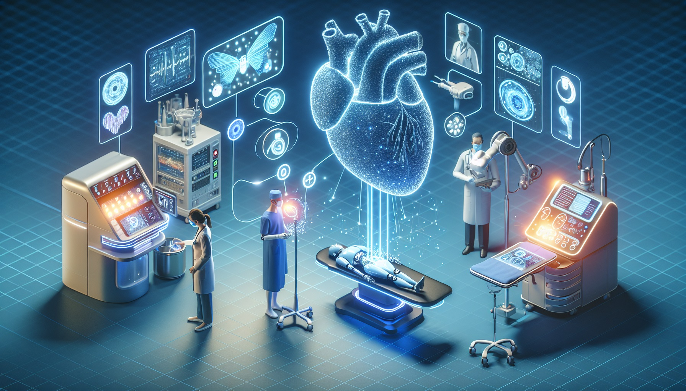
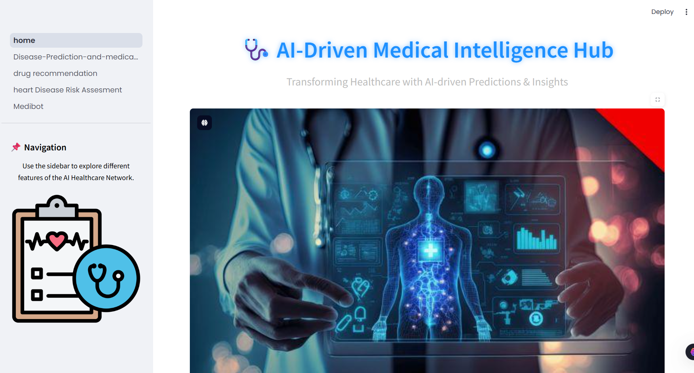
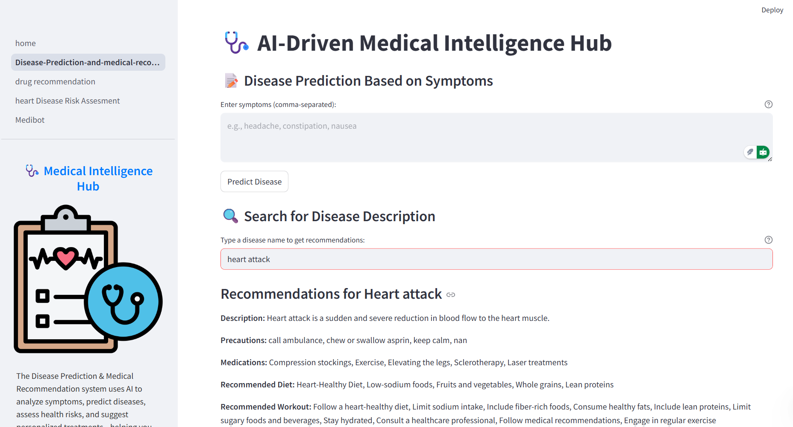
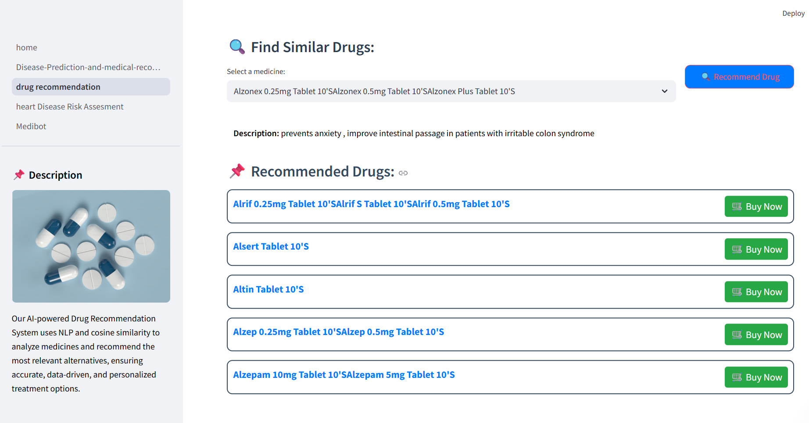
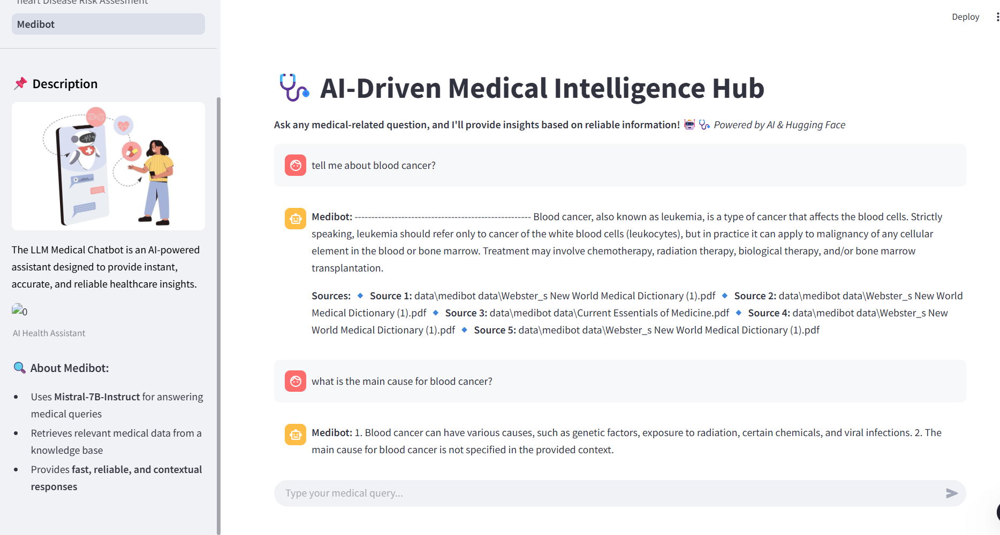

# 🩺 AI-Driven Medical Intelligence Hub

_Revolutionizing Healthcare with AI-Driven Predictions, Recommendations, and Insights._



---

## 📌 About This Project

**Medibot** is an intelligent, AI-driven healthcare platform designed to deliver real-time medical predictions, drug recommendations, heart disease risk assessment, and AI-powered medical Q&A. Built using cutting-edge Machine Learning (ML), Natural Language Processing (NLP), and Retrieval-Augmented Generation (RAG), it empowers both patients and medical professionals with early diagnosis, personalized recommendations, and data-driven insights.

> 🎯 Developed using Streamlit, Hugging Face Transformers, LangChain, FAISS, and trained ML models (RandomForest, LightGBM).

---

[](https://drive.google.com/file/d/1pXOFICXngShZTVbScYswAayKuf-jsOv9/view?usp=sharing)


## 🚀 Features

### 💡 Disease Prediction & Medical Recommendation
Predict diseases based on user symptoms and provide relevant treatments and lifestyle suggestions.

- ✅ Trained on medical symptom datasets using `RandomForestClassifier`
- ✅ Returns disease name, description, medication, diet, and precautions
- ✅ Fully interactive UI using Streamlit

**Screenshots:**



---

### 💊 AI-Powered Drug Recommendation
Suggests alternative medications using NLP & similarity search.

- ✅ Uses `Cosine Similarity` for matching drug vectors
- ✅ Trained on a curated dataset of drug names and compositions
- ✅ Recommends safe alternatives to existing medicines

**Screenshots:**



---

### 🪀 Heart Disease Risk Assessment
Estimates heart disease probability using health & lifestyle inputs.

- ✅ Models used: `LightGBM`, `EasyEnsembleClassifier`
- ✅ Inputs: Age, BMI, smoking, alcohol use, medical history, etc.
- ✅ Returns a personalized **Heart Risk Score** with preventive suggestions

**Screenshots:**


---

### 🤖 Medibot - AI Health Assistant (RAG + LLM)
A chatbot that answers medical queries in real-time using **Mistral-7B-Instruct** and FAISS.

- ✅ Uses **LangChain + FAISS** for context-aware medical Q&A
- ✅ Hugging Face integration with Retrieval Augmented Generation (RAG)
- ✅ Highly responsive LLM for fact-based medical advice

**Screenshots:**



---

## 📂 Folder Structure

```
📦 AI-Powered-Healthcare-Intelligence
│── 📂 models/                   # Trained ML models
│── 📂 data/                     # Medical datasets
│── 📂 vectorstore/db_faiss/     # FAISS vector store
│── 📂 utils/                    # Images, helper files
│── 📂 pages/                    # Streamlit module pages
│── 📜 home.py                   # Main Streamlit app
│── 📜 requirements.txt          # Required dependencies
│── 📜 .env                      # Environment variables (HF_TOKEN)
│── 📜 README.md                 # Project documentation
│── 📜 styles.css                # Custom CSS
```

---

## ⚙️ Installation & Setup

### 1️⃣ Clone the Repository
```bash
git clone https://github.com/coolguy-sree/Med_Intel_Hub.git
cd Med_Intel_Hub
```

### 2️⃣ Create a Virtual Environment
```bash
python -m venv venv
source venv/bin/activate      # On macOS/Linux
venv\Scripts\activate         # On Windows
```

### 3️⃣ Install Dependencies
```bash
pip install -r requirements.txt
```

### 4️⃣ Configure Environment
Create a `.env` file and add:
```env
HF_TOKEN=your_huggingface_api_token
```

> 🔐 Ensure `.env` is in your `.gitignore` and added as a **secret** if deploying.

### 5️⃣ Run the Application
```bash
streamlit run home.py
```

---

## 🚀 Deployment on Streamlit Cloud

1. Push code to GitHub:
```bash
git add .
git commit -m "Initial commit"
git push origin main
```

2. Go to [Streamlit Cloud](https://share.streamlit.io)
3. Create new app → Select this repo
4. Set `HF_TOKEN` in **Secrets**
5. Click **Deploy**

---

## ⚙️ Technologies Used

- **ML Models**: RandomForest, LightGBM, EasyEnsemble
- **NLP & LLMs**: Hugging Face Transformers, LangChain, FAISS
- **Web Framework**: Streamlit
- **Data**: Pandas, NumPy, Pickle
- **Visualization**: Plotly, SHAP
- **LLM Backend**: Mistral-7B-Instruct

---

## 🔍 Why Use Medibot?

- 🏥 AI-Powered Diagnosis & Recommendations
- ⚕️ Personalized Medical Suggestions
- 💬 Intelligent Medical Chatbot
- 📊 Data-Driven Health Risk Analytics
- ⏱️ Real-Time Results
- 🔒 Privacy-first Design with Local Execution Option

---

## 📜 License

This project is licensed under the **MIT License**.  
Feel free to use, modify, and contribute.

---

## 📬 Contact

**Surya Saroj**  
🔗 [LinkedIn](https://www.linkedin.com/in/iamsuryasarojsistla24/) | [GitHub](https://github.com/coolguy-sree)

---

> _"Empowering the future of healthcare with intelligent systems."_ 🌐
