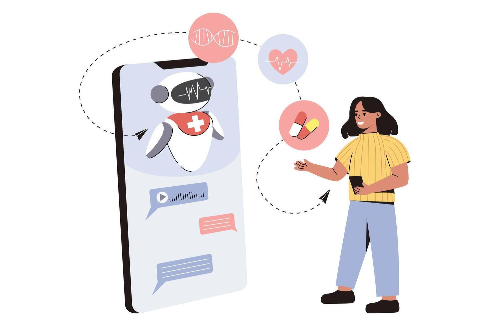
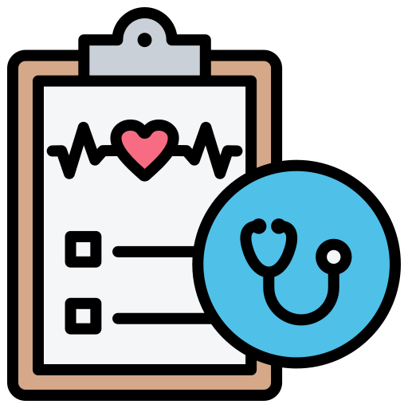

# 🩺 AI-Driven Medical Intelligence Hub


---

## Short Description

An AI-driven healthcare intelligence system that provides disease prediction based on symptoms, drug recommendations, heart disease risk assessment, and an AI-powered medical chatbot. This system leverages advanced machine learning models and natural language processing to assist users in making informed healthcare decisions.

---

## Table of Contents

- [Features](#features)
- [Installation Instructions](#installation-instructions)
- [Usage Guide](#usage-guide)
- [Screenshots and Demo Videos](#screenshots-and-demo-videos)
- [Technologies Used](#technologies-used)
- [Folder Structure](#folder-structure)
- [Contributing Guidelines](#contributing-guidelines)
- [License](#license)
- [Contact Information](#contact-information)

---

## Features

- Disease prediction based on user-input symptoms using machine learning models.
- Personalized drug recommendation system using NLP and similarity analysis.
- Heart disease risk assessment with detailed risk factors and recommendations.
- AI-powered medical chatbot for instant healthcare insights.
- User-friendly web interface built with Streamlit.
- Integration with Hugging Face models for advanced NLP capabilities.

---

## Installation Instructions

1. **Clone the repository:**

```bash
git clone <repository-url>
cd AI-Powered-Healthcare-Intelligence-System-main
```

2. **Create and activate a virtual environment (optional but recommended):**

```bash
python -m venv venv
# Windows
venv\Scripts\activate
# macOS/Linux
source venv/bin/activate
```

3. **Install the required dependencies:**

```bash
pip install -r requirements.txt
```

4. **Set up environment variables:**

- Create a `.env` file in the root directory.
- Add your Hugging Face API token:

```
HF_TOKEN=your_huggingface_api_token_here
```

---

## Usage Guide

- To run the Disease Prediction page:

```bash
streamlit run pages/1_Disease-Prediction-and-medical-recommendation.py
```

- To run the Drug Recommendation page:

```bash
streamlit run pages/2_drug_recommendation.py
```

- To run the Heart Disease Risk Assessment page:

```bash
streamlit run pages/3_heart_Disease_Risk_Assesment.py
```

- To run the AI Medical Chatbot (Medibot) page:

```bash
streamlit run pages/4_Medibot.py
```

---

## Screenshots and Demo Videos

### Demo Video


### Screenshots






---

## Technologies Used

- Python 3.13
- Streamlit for web UI
- Scikit-learn for machine learning models
- Hugging Face Transformers and LangChain for NLP and LLM integration
- FAISS for vector similarity search
- Pandas and NumPy for data processing
- Plotly for interactive visualizations

---

## Folder Structure

- `pages/` - Contains Streamlit app pages for different functionalities.
- `models/` - Pre-trained machine learning models and encoders.
- `data/` - Datasets used for training and reference.
- `utils/` - Utility files including images, CSS, and demo videos.
- `vectorstore/` - FAISS vector store for embeddings.
- `medibot/` - Code related to the AI medical chatbot.
- `requirements.txt` - Python dependencies.
- `README.md` - Project documentation.

---

## Contributing Guidelines

Contributions are welcome! Please follow these steps:

1. Fork the repository.
2. Create a new branch (`git checkout -b feature/your-feature`).
3. Make your changes and commit (`git commit -m 'Add some feature'`).
4. Push to the branch (`git push origin feature/your-feature`).
5. Open a Pull Request describing your changes.

Please ensure your code follows the existing style and includes appropriate tests.

---

## License

This project is licensed under the MIT License. See the [LICENSE](LICENSE) file for details.

---

## Contact Information

- Maintainer: Surya Saroj Sistla 
- Email: sistlasree24@gmail.com
- GitHub: [coolguy-sree](https://github.com/coolguy-sree)

---

Thank you for using the AI-Powered Healthcare Intelligence System! Your feedback and contributions are highly appreciated.
